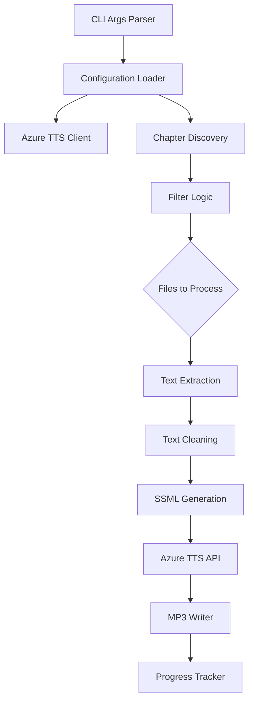

# Azure TTS Audio Generation Script Plan

## Overview

Create a Python script that uses Azure Cognitive Services Text-to-Speech API to generate MP3 audio files for Bible chapter readings.

## Requirements Summary

| Requirement | Decision |
|-------------|----------|
| Lexicon references | Strip `[[G####]]` patterns for clean audio |
| Output location | Single `audio/` folder with organized naming |
| Voice selection | CLI to list available voices and select one |
| Processing scope | Process all or specific books/chapters |
| Resume capability | Skip existing MP3 files automatically |

## Architecture

### File Structure

```
/
├── generate_audio.py          # Main script (new)
├── audio/                     # Output directory (new)
│   ├── Genesis_1.mp3
│   ├── Genesis_2.mp3
│   ├── Matthew_1.mp3
│   └── ...
├── bibles/BSB/...             # Source markdown files
└── data/content_manifest.json # Chapter list reference
```

### Output File Naming Convention

Format: `{Book}_{Chapter}.mp3`

Examples:
- `Genesis_1.mp3`
- `1_Samuel_3.mp3` (spaces replaced with underscores)
- `Song_of_Solomon_1.mp3`

## Script Design

### CLI Interface

```bash
# List available voices
python generate_audio.py --list-voices

# Generate all chapters with selected voice
python generate_audio.py --voice "en-US-JennyNeural"

# Generate specific book
python generate_audio.py --voice "en-US-JennyNeural" --book "Matthew"

# Generate specific chapter
python generate_audio.py --voice "en-US-JennyNeural" --book "Matthew" --chapter 1

# Dry run (show what would be processed)
python generate_audio.py --voice "en-US-JennyNeural" --dry-run

# Force overwrite existing files
python generate_audio.py --voice "en-US-JennyNeural" --force
```

### Configuration

The script will accept Azure credentials via:
1. Environment variables (preferred): `AZURE_TTS_KEY` and `AZURE_TTS_REGION`
2. Command-line arguments: `--key` and `--region`
3. `.env` file support

### Core Components



### Text Processing Pipeline

1. **Read Markdown File**: Load chapter content
2. **Extract Verse Text**: Parse markdown, extract text between verse markers
3. **Clean Text**: Remove lexicon references `[[G####]]`, brackets, extra whitespace
4. **Generate SSML**: Wrap in SSML with appropriate prosody settings
5. **Send to Azure**: Call TTS API with SSML
6. **Save MP3**: Write binary response to output file

### Text Cleaning Rules

| Pattern | Action | Example |
|---------|--------|---------|
| `[[G####]]` | Remove completely | `[[G976]]` → `` |
| `[[G####` | Remove incomplete | `[[G976` → `` |
| `]]` | Remove orphaned close | `]]` → `` |
| Multiple spaces | Collapse to single | `word  word` → `word word` |
| Leading/trailing whitespace | Trim | ` text ` → `text` |

### Chapter Discovery Logic

```python
def discover_chapters(base_path, content_manifest):
    chapters = []
    for file_path in content_manifest['files']:
        if file_path.startswith('bibles/') and file_path.endswith('.md'):
            # Skip book index files (no chapter number in filename)
            if is_chapter_file(file_path):
                chapters.append(parse_chapter_info(file_path))
    return chapters

def is_chapter_file(file_path):
    # Files like "Genesis 1.md" or "1 John 1.md" are chapters
    # Files like "Genesis.md" or "1 John.md" are book indexes
    filename = os.path.basename(file_path)
    name_without_ext = filename[:-3]
    # Check if ends with a number (chapter)
    return name_without_ext.split()[-1].isdigit()
```

### Progress Tracking

- Display progress bar using `tqdm` or custom implementation
- Show current file, total progress, and estimated time remaining
- Log completed files to allow resume after interruption

### Error Handling

| Error Type | Handling |
|------------|----------|
| Azure auth failure | Clear error message with setup instructions |
| Rate limiting | Exponential backoff retry |
| Network timeout | Retry with timeout increase |
| Invalid SSML | Log error, skip file, continue |
| File write failure | Log error, continue to next |

## Dependencies

```
azure-cognitiveservices-speech>=1.30.0
python-dotenv>=1.0.0
tqdm>=4.65.0
```

## Azure TTS API Details

### Authentication

```python
import azure.cognitiveservices.speech as speechsdk

speech_config = speechsdk.SpeechConfig(
    subscription="YOUR_KEY",
    region="YOUR_REGION"
)
speech_config.speech_synthesis_voice_name = "en-US-JennyNeural"
```

### Voice Listing

```python
# Use REST API to list voices
# GET https://{region}.tts.speech.microsoft.com/cognitiveservices/voices/list
```

### Synthesis

```python
synthesizer = speechsdk.SpeechSynthesizer(
    speech_config=speech_config,
    audio_config=None  # We want raw audio data
)

result = synthesizer.speak_ssml_async(ssml_string).get()
audio_data = result.audio_data
```

### SSML Template

```xml
<speak version="1.0" xmlns="http://www.w3.org/2001/10/synthesis" xml:lang="en-US">
    <voice name="en-US-JennyNeural">
        <prosody rate="0.9" pitch="0%">
            {chapter_title}. {verse_text}
        </prosody>
    </voice>
</speak>
```

## Implementation Steps

1. **Create script skeleton** with argparse CLI
2. **Implement configuration** with environment variables and .env support
3. **Add Azure client wrapper** with voice listing and synthesis
4. **Implement chapter discovery** using content_manifest.json
5. **Add text extraction** from markdown files
6. **Implement text cleaning** to remove lexicon references
7. **Add SSML generation** with proper formatting
8. **Implement MP3 output** with proper naming
9. **Add progress tracking** with resume capability
10. **Add error handling** and logging
11. **Update documentation** in Readme.md

## Future Considerations

Note in Readme.md that the app currently looks for audio at:
```
bibles/BSB/BER-{Book}/Audio/{Book} {Chapter}/part_0.mp3
```

But this script generates to:
```
audio/{Book}_{Chapter}.mp3
```

Future work will update the app to look in the new location.

## Testing Strategy

1. Test with a single small chapter first
2. Verify audio quality and text cleaning
3. Test resume functionality by interrupting and restarting
4. Test error handling with invalid inputs
5. Test voice listing functionality

## Security Notes

- Never commit Azure keys to the repository
- Use environment variables or .env files (add .env to .gitignore)
- Document key setup in Readme.md
