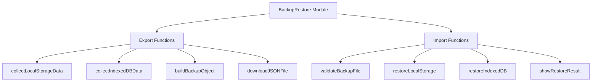

# Backup & Restore Feature Implementation Plan

## Overview

This document outlines the implementation plan for the Backup & Restore feature in WordWideWeb. The feature will allow users to export all their data to a JSON file and restore it on another device or after clearing browser data.

## Current Data Architecture Analysis

### Data Storage Locations

#### 1. localStorage (via AppAPI)

**Settings** - Prefixed with `Settings_`:
| Key | Description | Type |
|-----|-------------|------|
| `Settings_BibleThemeMode` | Theme preference | string |
| `Settings_BibleAccentColor` | Accent color hex | string |
| `Settings_BibleTextSize` | Font size in pixels | string |
| `Settings_BibleLastRead` | Last read chapter path | string |
| `Settings_BibleHistory` | Reading history array | JSON string |
| `Settings_BibleAutoSearch` | Auto search query | string |
| `Settings_BibleAudioSpeed` | Audio playback speed | string |
| `Settings_BibleAutoPlay` | Auto-play setting | string |
| `Settings_ReadingPlansSubscribed` | Subscribed plans with progress | JSON string |

**User Data** - Prefixed with `User_`:
| Key Pattern | Description | Type |
|-------------|-------------|------|
| `User_{path}.json` | Chapter highlight data | JSON string |
| `User_Note_{chapterName}` | Chapter notes | plain text |

#### 2. IndexedDB - `WordWideWebStats`

| Object Store | Purpose | Key Path |
|--------------|---------|----------|
| `reading_sessions` | Individual reading events | auto-increment id |
| `daily_stats` | Pre-aggregated daily statistics | dateKey (YYYY-MM-DD) |
| `book_progress` | Per-book completion tracking | bookName |
| `engagement_events` | Highlights and notes events | auto-increment id |

## Backup Data Schema

```json
{
  "version": "1.0",
  "exportDate": "2026-02-21T12:00:00.000Z",
  "appVersion": "WordWideWeb",
  "data": {
    "settings": {
      "theme": "light",
      "accentColor": "#0061a4",
      "textSize": 19,
      "lastRead": "bibles/BSB/BER-Genesis/Genesis 1.md",
      "audioSpeed": "1.0",
      "autoPlay": false
    },
    "history": ["Genesis 1", "Genesis 2"],
    "readingPlans": [
      {
        "planId": "bible-in-a-year",
        "startDate": "2026-01-01",
        "completedDays": [1, 2, 3]
      }
    ],
    "highlights": {
      "bibles/BSB/BER-Genesis/Genesis 1.json": {
        "v-1-w-0": "hl-yellow",
        "v-2": "hl-blue"
      }
    },
    "notes": {
      "Genesis 1": "My study notes on Genesis 1..."
    },
    "statistics": {
      "reading_sessions": [],
      "daily_stats": [],
      "book_progress": [],
      "engagement_events": []
    }
  }
}
```

## Implementation Components

### 1. New Module: `js/backup-restore.js`



### 2. Key Functions

#### Export Functions
- `exportAllData()` - Main entry point for backup
- `collectLocalStorageSettings()` - Gather all Settings_ keys
- `collectLocalStorageUserData()` - Gather all User_ keys
- `collectIndexedDBData()` - Export all object stores
- `generateBackupJSON()` - Assemble complete backup object
- `triggerDownload()` - Create and download JSON file

#### Import Functions
- `importBackupFile(file)` - Main entry point for restore
- `validateBackupSchema(data)` - Verify backup file structure
- `restoreSettings(data)` - Restore localStorage settings
- `restoreHighlights(data)` - Restore highlight data
- `restoreNotes(data)` - Restore note data
- `restoreReadingPlans(data)` - Restore plan subscriptions
- `restoreStatistics(data)` - Restore IndexedDB data
- `confirmRestore()` - User confirmation dialog

### 3. UI Components

#### Settings Modal Addition
Add a new section to the existing settings modal:

```html
<div class="backup-restore-section">
  <h3>Backup & Restore</h3>
  <p class="section-desc">Export or import all your data including highlights, notes, reading plans, and statistics.</p>
  
  <div class="backup-actions">
    <button class="btn-fill" onclick="BackupRestore.exportAllData()">
      <span class="material-icons-round">download</span>
      Export Backup
    </button>
    <button class="btn-outline" onclick="BackupRestore.triggerFileInput()">
      <span class="material-icons-round">upload</span>
      Import Backup
    </button>
  </div>
  
  <input type="file" id="backupFileInput" accept=".json" style="display:none" onchange="BackupRestore.handleFileSelect(event)">
</div>
```

#### Restore Confirmation Modal
A modal to show backup contents and confirm restore:

```html
<div id="restoreModal" class="modal">
  <div class="modal-content">
    <h2>Restore Backup</h2>
    <div class="restore-preview">
      <!-- Shows summary of what will be restored -->
    </div>
    <div class="restore-warning">
      Warning: This will replace all current data
    </div>
    <div class="modal-actions">
      <button class="btn-text" onclick="BackupRestore.cancelRestore()">Cancel</button>
      <button class="btn-fill" onclick="BackupRestore.confirmRestore()">Restore</button>
    </div>
  </div>
</div>
```

## Implementation Steps

### Step 1: Create Backup Module
Create `js/backup-restore.js` with the complete BackupRestore object containing all export and import functions.

### Step 2: Add UI to Settings
Modify `index.html` to add backup/restore section to the settings modal and add the restore confirmation modal.

### Step 3: Add Styles
Add CSS styles for the backup/restore UI components to `css/style.css`.

### Step 4: Initialize Module
Add BackupRestore initialization in `js/app.js` within the App.init() function.

### Step 5: Testing
Test the following scenarios:
- Export backup with all data types present
- Export backup with empty data
- Import valid backup file
- Import invalid/corrupted backup file
- Import backup from older version
- Cancel restore operation
- Verify data integrity after restore

## Data Migration Considerations

### Version Compatibility
- Include version number in backup schema
- Handle imports from older versions gracefully
- Log warnings for unrecognized fields

### Conflict Resolution
- Current data is completely replaced on restore
- User must confirm before restore proceeds
- Option to export current data before restore

## Error Handling

| Error Case | Handling |
|------------|----------|
| IndexedDB read failure | Show error, continue with partial backup |
| File read error | Show error message to user |
| Invalid JSON | Show parsing error to user |
| Schema validation failure | Show specific validation errors |
| IndexedDB write failure | Rollback transaction, show error |

## File Naming Convention

Backup files will be named with timestamp:
```
wordwideweb-backup-2026-02-21.json
```

## Security Considerations

- Backup files contain unencrypted user data
- Users should store backup files securely
- No sensitive authentication data is stored
- All data is client-side only

## Future Enhancements

Potential future improvements:
- Cloud backup integration (Google Drive, Dropbox)
- Encrypted backup option
- Selective restore (choose what to restore)
- Automatic scheduled backups
- Backup to browser sync storage
