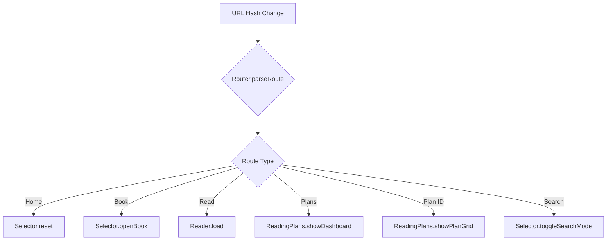

# Deep Linking Implementation Plan

## Overview

This document outlines the implementation plan for adding deep linking support to WordWideWeb, enabling URL routing, shareable chapter links, and browser navigation support.

## Current State Analysis

### Application Architecture
- **Single Page Application (SPA)** with multiple views managed via CSS class toggling
- **Views:** `view-selector`, `view-reader`, `view-plans`, `view-plans-grid`
- **Navigation:** Currently handled through JavaScript function calls without URL changes
- **State Storage:** localStorage for user data (last read, history, highlights, notes)

### Key Functions to Integrate With
- [`Reader.load(path, name)`](js/app.js:257) - Loads and displays a chapter
- [`Selector.openBook(b)`](js/app.js:77) - Opens book chapter selection
- [`ReadingPlans.showDashboard()`](js/app.js:701) - Shows reading plans list
- [`ReadingPlans.showPlanGrid(planId)`](js/app.js:870) - Shows specific plan
- [`App.goHome()`](js/app.js:40) - Returns to home view

## Static Hosting Compatibility

**Hash-based routing (`#/path`) is required for GitHub Pages compatibility.**

| Approach | URL Example | GitHub Pages Compatible? |
|----------|-------------|-------------------------|
| Hash Routing | `#/read/Genesis/1` | ✅ Yes - Works natively |
| History API | `/read/Genesis/1` | ❌ No - Requires server rewrites |

**Why Hash Routing Works:**
1. The `#` fragment is **never sent to the server** - handled entirely client-side
2. GitHub Pages serves `index.html` for any URL
3. JavaScript parses the hash on page load and navigates to the correct view
4. No `.nojekyll` or 404.html hacks needed

**Example Flow:**
1. User opens `https://flexingg.github.io/WordWideWeb/#/read/Genesis/1`
2. GitHub Pages serves `index.html`
3. JavaScript detects hash `#/read/Genesis/1`
4. Router parses and calls `Reader.load()` for Genesis 1

## URL Structure Design

### Hash-Based Routing
Using hash-based routing (`#/path`) for compatibility with static hosting (GitHub Pages) without server-side configuration.

| View | URL Pattern | Example |
|------|-------------|---------|
| Home | `#/` or `#` | `https://example.com/#/` |
| Book Selection | `#/book/{bookName}` | `#/book/Genesis` |
| Chapter Reading | `#/read/{book}/{chapter}` | `#/read/Genesis/1` |
| Reading Plans | `#/plans` | `#/plans` |
| Specific Plan | `#/plans/{planId}` | `#/plans/bible-in-a-year` |
| Search | `#/search/{query}` | `#/search/love` |

### URL Encoding Considerations
- Book names with spaces: `#/read/1%20Samuel/3` or `#/read/1_Samuel/3`
- Use `encodeURIComponent()` / `decodeURIComponent()` for proper handling

## Implementation Architecture

### New Router Module

```javascript
const Router = {
    // Current route state
    currentRoute: null,
    
    // Initialize router and handle initial URL
    init: () => {},
    
    // Parse current hash into route object
    parseRoute: () => {},
    
    // Navigate to a route (updates URL and calls handler)
    navigate: (path, state = {}) => {},
    
    // Handle route changes (from popstate or navigate)
    handleRoute: (route) => {},
    
    // Replace URL without adding history entry
    replace: (path, state = {}) => {},
    
    // Go back in history
    back: () => {}
};
```

### Route Handlers



## Implementation Steps

### Step 1: Create Router Module
Create a new `Router` object in [`js/app.js`](js/app.js) that handles:
- Hash change event listening
- URL parsing and route matching
- History API integration
- Route handler dispatching

### Step 2: Integrate Router with Existing Functions
Modify existing navigation functions to use the router:

| Function | Modification |
|----------|--------------|
| [`Reader.load()`](js/app.js:257) | Call `Router.navigate()` after loading |
| [`Selector.openBook()`](js/app.js:77) | Call `Router.navigate()` when opening book |
| [`ReadingPlans.showDashboard()`](js/app.js:701) | Call `Router.navigate()` |
| [`ReadingPlans.showPlanGrid()`](js/app.js:870) | Call `Router.navigate()` |
| [`App.goHome()`](js/app.js:40) | Call `Router.navigate('/')` |
| [`App.navBack()`](js/app.js:34) | Use `Router.back()` |

### Step 3: Handle Browser Navigation
Implement `popstate` / `hashchange` event handler:
- Parse the new URL
- Call appropriate handler WITHOUT adding new history entry
- Preserve scroll position where applicable

### Step 4: Add Share Functionality
Add share button to reader view:
- Use Web Share API when available
- Fallback to clipboard copy
- Share URL format: `https://example.com/#/read/Genesis/1`

### Step 5: Update App Initialization
Modify [`App.init()`](js/app.js:13) to:
- Initialize Router first
- Handle initial URL route on page load
- Support direct links to any view

### Step 6: Update Manifest
Update [`manifest.json`](manifest.json) for PWA deep linking:
- Add `start_url` with hash support
- Ensure `scope` is correct

## Code Changes Summary

### Files to Modify

1. **[`js/app.js`](js/app.js)** - Add Router module and integrate with existing functions
2. **[`index.html`](index.html)** - Add share button to header
3. **[`css/style.css`](css/style.css)** - Style share button
4. **[`manifest.json`](manifest.json)** - Update start_url

### New Code Additions

```javascript
// Router Module - to be added to js/app.js
const Router = {
    currentRoute: null,
    
    init: () => {
        window.addEventListener('hashchange', Router.onHashChange);
        Router.handleInitialRoute();
    },
    
    handleInitialRoute: () => {
        const hash = window.location.hash;
        if(hash && hash.length > 1) {
            Router.handleRoute(Router.parseRoute(hash));
        }
    },
    
    parseRoute: (hash) => {
        const path = hash.replace(/^#/, '').replace(/^\//, '');
        const parts = path.split('/').filter(p => p);
        
        if(parts.length === 0) return { type: 'home' };
        if(parts[0] === 'book' && parts[1]) return { type: 'book', book: decodeURIComponent(parts[1]) };
        if(parts[0] === 'read' && parts[1] && parts[2]) return { type: 'read', book: decodeURIComponent(parts[1]), chapter: parseInt(parts[2]) };
        if(parts[0] === 'plans' && parts[1]) return { type: 'plan', planId: parts[1] };
        if(parts[0] === 'plans') return { type: 'plans' };
        if(parts[0] === 'search' && parts[1]) return { type: 'search', query: decodeURIComponent(parts[1]) };
        
        return { type: 'home' };
    },
    
    navigate: (path, state = {}) => {
        window.location.hash = path;
    },
    
    onHashChange: () => {
        const route = Router.parseRoute(window.location.hash);
        Router.handleRoute(route, false);
    },
    
    handleRoute: (route, pushHistory = true) => {
        // Route handling logic
        switch(route.type) {
            case 'home':
                Selector.reset();
                break;
            case 'book':
                const book = BOOKS.find(b => b.n === route.book);
                if(book) Selector.openBook(book, false);
                break;
            case 'read':
                const name = `${route.book} ${route.chapter}`;
                const path = `bibles/BSB/BER-${route.book}/${name}.md`;
                Reader.load(path, name, false);
                break;
            case 'plans':
                ReadingPlans.showDashboard(false);
                break;
            case 'plan':
                ReadingPlans.showPlanGrid(route.planId, false);
                break;
            case 'search':
                Selector.toggleSearchMode(true, route.query, false);
                break;
        }
        Router.currentRoute = route;
    }
};
```

## Testing Checklist

- [ ] Direct link to home page loads correctly
- [ ] Direct link to book selection shows chapters
- [ ] Direct link to chapter opens reader
- [ ] Direct link to reading plans shows dashboard
- [ ] Direct link to specific plan shows plan grid
- [ ] Browser back button navigates correctly
- [ ] Browser forward button navigates correctly
- [ ] Share button generates correct URL
- [ ] Share works on mobile devices
- [ ] URL updates when navigating within app
- [ ] Page refresh maintains current view
- [ ] Book names with spaces work correctly (e.g., "1 Samuel")

## Future Enhancements

- Verse-level deep linking: `#/read/Genesis/1/5` (verse 5)
- Search results preservation in URL
- Reading plan day in URL: `#/plans/bible-in-a-year/day/5`
