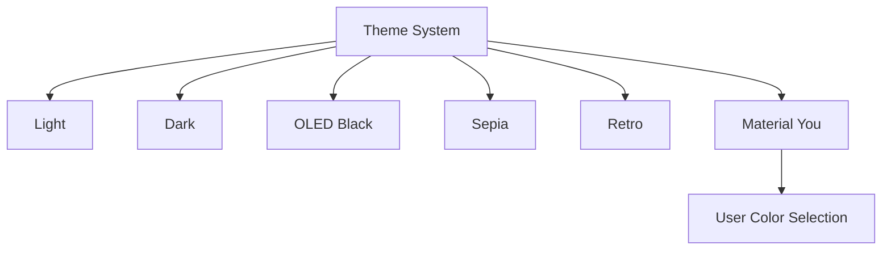

# Font & Theme Customization Implementation Plan

## Overview

This document outlines the implementation plan for adding font and theme customization features to WordWideWeb, as specified in the Readme.md roadmap.

## Feature Requirements

From Readme.md Phase 1:
- **Font Customization:** Settings menu to adjust font face (Serif/Sans), size, and line height
- **Theme Options:** Expanded theme options including:
  - OLED Black (pure black for AMOLED screens)
  - Sepia (warm, paper-like tones)
  - Retro (vintage aesthetic)
  - Material You (dynamic color based on user selection)

---

## Architecture Analysis

### Current State

**Theme System:**
- CSS variables defined in [`:root`](css/style.css:2) for light mode
- `[data-theme="dark"]` selector for dark mode
- Theme toggled via [`App.toggleTheme()`](js/app.js:143) 
- Stored in localStorage as `BibleThemeMode`

**Font Settings:**
- Font family: `'Roboto Serif', serif` hardcoded in [`body`](css/style.css:48)
- Font size: `19px` hardcoded
- Line height: `1.7` hardcoded

---

## Implementation Design

### 1. CSS Architecture

#### 1.1 New CSS Custom Properties for Fonts

```css
:root {
    /* Font Settings - will be overridden via JS */
    --font-family: 'Roboto Serif', serif;
    --font-size: 19px;
    --line-height: 1.7;
    
    /* Font family presets */
    --font-serif: 'Roboto Serif', Georgia, serif;
    --font-sans: 'Roboto', -apple-system, sans-serif;
}
```

#### 1.2 Theme Definitions



**Theme Color Tokens:**

| Theme | Background | Surface | Text | Primary |
|-------|------------|---------|------|---------|
| Light | #fdfcff | #ffffff | #1a1c1e | #0061a4 |
| Dark | #1a1c1e | #36383b | #e2e2e6 | #9ecaff |
| OLED | #000000 | #0a0a0a | #ffffff | #bb86fc |
| Sepia | #f4ecd8 | #faf6eb | #5b4636 | #8b5a2b |
| Retro | #f0e6d3 | #e8dcc8 | #3d3426 | #c45c26 |
| MaterialYou | dynamic | dynamic | dynamic | user-pick |

#### 1.3 Material You Implementation

Material You will generate a full color palette from a user-selected seed color using HCT (Hue, Chroma, Tone) color science principles. The implementation will:

1. Let user pick a seed color via color picker
2. Generate primary, secondary, tertiary, and neutral tonal palettes
3. Apply generated colors to all theme tokens

### 2. Settings UI Component

#### 2.1 Settings Modal Structure

```
┌─────────────────────────────────────┐
│ Settings                      [X]   │
├─────────────────────────────────────┤
│                                     │
│ 📖 READING                          │
│ ─────────────────────────────────── │
│ Font Family     [Serif ▼]          │
│ Font Size       [━━●━━━] 19px      │
│ Line Height     [━━━●━━] 1.7       │
│                                     │
│ 🎨 APPEARANCE                       │
│ ─────────────────────────────────── │
│ Theme           [●] [○] [○] [○] [○]│
│                 Light Dark OLED ... │
│                                     │
│ Material You Color                  │
│ [████████] Pick a color             │
│                                     │
│            [Reset to Defaults]      │
└─────────────────────────────────────┘
```

#### 2.2 UI Components Needed

1. **Settings Button** - Add to header next to theme toggle
2. **Settings Modal** - Bottom sheet style matching existing modals
3. **Font Family Dropdown** - Serif/Sans toggle
4. **Font Size Slider** - Range 14px to 28px
5. **Line Height Slider** - Range 1.4 to 2.2
6. **Theme Selector** - Visual radio buttons for themes
7. **Color Picker** - For Material You theme

### 3. JavaScript Implementation

#### 3.1 Settings Manager Module

```javascript
const Settings = {
    // Default values
    defaults: {
        fontFamily: 'serif',
        fontSize: 19,
        lineHeight: 1.7,
        theme: 'light',
        materialYouColor: '#0061a4'
    },
    
    // Current settings
    current: {},
    
    // Initialize settings from localStorage
    init() {},
    
    // Load settings from localStorage
    load() {},
    
    // Save settings to localStorage
    save() {},
    
    // Apply font settings to CSS variables
    applyFontSettings() {},
    
    // Apply theme
    applyTheme(themeName) {},
    
    // Generate Material You palette from seed color
    generateMaterialYouPalette(seedColor) {},
    
    // Reset to defaults
    reset() {},
    
    // Open settings modal
    openModal() {},
    
    // Close settings modal
    closeModal() {}
};
```

#### 3.2 localStorage Keys

| Key | Type | Description |
|-----|------|-------------|
| `BibleFontFamily` | string | 'serif' or 'sans' |
| `BibleFontSize` | number | Font size in pixels (14-28) |
| `BibleLineHeight` | number | Line height multiplier (1.4-2.2) |
| `BibleThemeMode` | string | Theme name (light/dark/oled/sepia/retro/materialYou) |
| `BibleMaterialYouColor` | string | Hex color for Material You seed |

### 4. File Changes Summary

#### 4.1 CSS Changes ([`css/style.css`](css/style.css))

1. Add font CSS custom properties to `:root`
2. Update `body` to use CSS variables instead of hardcoded values
3. Add new theme definitions:
   - `[data-theme="oled"]`
   - `[data-theme="sepia"]`
   - `[data-theme="retro"]`
   - `[data-theme="materialYou"]`
4. Add styles for settings modal and controls

#### 4.2 JavaScript Changes ([`js/app.js`](js/app.js))

1. Add `Settings` module
2. Update `App.init()` to initialize settings
3. Update `App.applyTheme()` to support new themes
4. Remove/modify `App.toggleTheme()` for multi-theme support

#### 4.3 HTML Changes ([`index.html`](index.html))

1. Add settings button to header
2. Add settings modal markup
3. Add Google Fonts link for additional fonts if needed

---

## Detailed Implementation Steps

### Step 1: CSS Theme Variables

Add new CSS custom properties and theme definitions to [`css/style.css`](css/style.css):

1. Add font variables to `:root`
2. Create `[data-theme="oled"]` with pure black background
3. Create `[data-theme="sepia"]` with warm paper tones
4. Create `[data-theme="retro"]` with vintage colors
5. Create `[data-theme="materialYou"]` structure

### Step 2: Settings Modal UI

Add settings modal to [`index.html`](index.html):

1. Create modal container with bottom-sheet style
2. Add font controls section
3. Add theme selection section
4. Add Material You color picker
5. Add reset button

### Step 3: Settings Button

Add settings button to header in [`index.html`](index.html):

1. Add button with settings icon
2. Position near theme toggle button

### Step 4: JavaScript Settings Module

Add `Settings` module to [`js/app.js`](js/app.js):

1. Implement `init()`, `load()`, `save()` methods
2. Implement font application logic
3. Implement theme switching logic
4. Implement Material You color generation
5. Implement modal open/close handlers

### Step 5: Material You Color Generation

Implement algorithm to generate Material You palette:

1. Convert seed color to HSL
2. Generate tonal palette (light to dark variants)
3. Generate complementary/analagous colors
4. Apply to theme CSS variables

### Step 6: Integration

Wire everything together:

1. Call `Settings.init()` in `App.init()`
2. Update theme toggle to cycle through themes or open settings
3. Ensure settings persist across sessions

---

## UI/UX Considerations

### Theme Selection UX

Option A: Cycle through themes with toggle button
- Simple, one-tap switching
- Hard to find specific theme

Option B: Settings modal with visual theme picker
- More discoverable
- Shows all options at once
- **Recommended approach**

### Font Preview

Consider showing live preview of font settings in the settings modal before applying.

### Accessibility

- Ensure all themes meet WCAG contrast requirements
- Font size should support user's browser settings as baseline
- All controls must be keyboard accessible

---

## Testing Checklist

- [ ] All themes render correctly
- [ ] Font family toggle works
- [ ] Font size slider updates in real-time
- [ ] Line height slider updates in real-time
- [ ] Material You generates valid colors
- [ ] Settings persist after page reload
- [ ] Settings persist after app reinstall (localStorage)
- [ ] No flash of unstyled content on load
- [ ] Works offline (no external font dependencies)
- [ ] All themes meet accessibility contrast requirements

---

## Estimated Complexity

| Component | Complexity |
|-----------|------------|
| CSS Theme Variables | Low |
| Settings Modal UI | Medium |
| Font Controls | Low |
| Theme Switching | Low |
| Material You Colors | High |
| Integration | Medium |
| Testing | Medium |

**Overall: Medium-High complexity** due to Material You color generation algorithm.

---

## Questions for Clarification

1. **Material You Implementation Depth:** ~~Should we implement a full HCT-based color algorithm, or use a simpler HSL-based approach that approximates Material You?~~ **DECIDED: Full HCT-based implementation**

2. **Font Options:** ~~Should we offer more than just Serif/Sans? (e.g., Dyslexic-friendly font, Mono for study)~~ **DECIDED: Just Serif/Sans fonts**

3. **Theme Toggle Behavior:** ~~Should the header theme button cycle through themes, or always open the settings modal?~~ **DECIDED: Open settings modal from header**

4. **Per-Chapter Settings:** Should font settings be global, or allow per-chapter customization?

5. **Import/Export:** Should settings be included in the planned Backup & Restore feature (Phase 2)?

---

## Final Design Decisions

Based on user feedback, the following decisions have been made:

| Decision | Choice |
|----------|--------|
| Material You Algorithm | Full HCT-based color generation |
| Theme Toggle Behavior | Header button opens settings modal |
| Font Options | Serif and Sans-serif only |

### HCT Color Algorithm for Material You

HCT (Hue, Chroma, Tone) is Google's color system used in Material You. The implementation will:

1. **Convert hex to HCT:**
   - Convert hex color to XYZ color space
   - Convert XYZ to CAM16 color appearance model
   - Extract Hue, Chroma, Tone values

2. **Generate tonal palette:**
   - Create colors at tones: 0, 10, 20, 30, 40, 50, 60, 70, 80, 90, 95, 99, 100
   - Keep hue constant, vary tone

3. **Generate semantic colors:**
   - Primary: High chroma at key tones
   - Secondary: Lower chroma variant
   - Tertiary: Complementary hue
   - Neutral: Very low chroma
   - Neutral-Variant: Slightly higher chroma

4. **Apply to theme tokens:**
   - Map generated colors to CSS custom properties
   - Ensure proper contrast ratios for accessibility