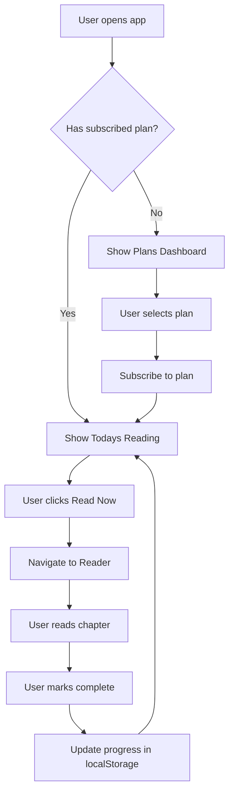

# Reading Plans Feature Implementation Plan

## Overview

Implement a Reading Plans dashboard where users can subscribe to JSON-based reading plans (e.g., "Bible in a Year") hosted in the repo. The app tracks progress locally in localStorage.

## Architecture Analysis

### Current Codebase Structure
- **Vanilla JavaScript (ES6+)** with no frameworks
- **Material 3 Design** with CSS variables for theming
- **localStorage** for all user data (highlights, notes, history)
- **Static API pattern** - fetches markdown/JSON files on demand

### Key Modules in [`js/app.js`](js/app.js)
- `App` - Core initialization and navigation
- `Selector` - Book/chapter selection UI
- `Reader` - Chapter rendering and interactions
- `ReaderAudio` - Audio playback
- `ReaderScroll` - Auto-scroll functionality

### Data Storage Pattern (from [`js/adapter.js`](js/adapter.js))
- `AppAPI.saveData(key, data)` - Saves to localStorage with "User_" prefix
- `AppAPI.loadData(key)` - Loads from localStorage
- `AppAPI.setGlobal(key, val)` - Saves settings with "Settings_" prefix
- `AppAPI.getGlobal(key)` - Loads settings

---

## Design Decisions (Confirmed)

1. **Plan Start Behavior**: Support both calendar-based plans (e.g., "Start January 1") and subscription-based plans (Day 1 = first day of subscription). Plan JSON will include a `startMode` field.

2. **Multiple Plans**: Users can subscribe to multiple plans simultaneously. Progress tracked independently for each plan.

3. **Completion Celebration**: No celebration UI. Simple completion indicator in progress view.

---

## Feature Design

### 1. Reading Plan JSON Structure

Plans will be stored as JSON files in a new `/plans/` directory:

```json
{
  "id": "bible-in-a-year",
  "name": "Bible in a Year",
  "description": "Read the entire Bible in 365 days",
  "totalDays": 365,
  "startMode": "subscription",
  "readings": [
    {
      "day": 1,
      "sections": [
        { "label": "Old Testament", "reference": "Genesis 1" },
        { "label": "New Testament", "reference": "Matthew 1" }
      ]
    },
    {
      "day": 2,
      "sections": [
        { "label": "Old Testament", "reference": "Genesis 2" },
        { "label": "New Testament", "reference": "Matthew 2" }
      ]
    }
  ]
}
```

**Calendar-based plan example:**
```json
{
  "id": "chronological-annual",
  "name": "Chronological Bible Reading",
  "description": "Read the Bible in historical order",
  "totalDays": 365,
  "startMode": "calendar",
  "startDate": "01-01",
  "readings": [...]
}
```

### 2. Progress Tracking Structure

Stored in localStorage as an array of subscribed plans:

```json
{
  "subscribedPlans": [
    {
      "planId": "bible-in-a-year",
      "startDate": "2026-02-14",
      "completedDays": [1, 2, 3, 5],
      "lastViewedDay": 5
    },
    {
      "planId": "chronological-annual",
      "startDate": null,
      "completedDays": [45, 46],
      "lastViewedDay": 46
    }
  ]
}
```

### 3. UI Components

#### A. Plans Dashboard View
- List of available reading plans (fetched from `/plans/index.json`)
- Each plan shows: name, description, total days, progress bar
- Subscribe/Unsubscribe buttons
- Active plan highlighted

#### B. Daily Reading View
- Shows today's reading sections
- Mark day as complete button
- Navigate to previous/next days
- Progress indicator (Day X of Y)

#### C. Header Integration
- New "Plans" button in header (calendar_today icon)
- Badge showing current day number when subscribed

### 4. New Module: ReadingPlans

```javascript
const ReadingPlans = {
    // State
    availablePlans: [],          // List of plan metadata from index.json
    loadedPlans: {},             // Cached full plan data by planId
    subscribedPlans: [],         // User's subscribed plans with progress
    
    // Initialization
    init: () => {},              // Load subscribed plans from localStorage
    loadPlansIndex: async () => {},    // Fetch /plans/index.json
    
    // Plan Management
    loadPlan: async (planId) => {},    // Fetch specific plan JSON
    subscribe: (planId) => {},         // Subscribe to a plan
    unsubscribe: (planId) => {},       // Unsubscribe from a plan
    isSubscribed: (planId) => {},      // Check if subscribed
    
    // Reading Access
    getPlanProgress: (planId) => {},   // Get progress for a plan
    getCurrentDay: (planId) => {},     // Calculate current day for plan
    getDayReading: (planId, dayNum) => {}, // Get reading for specific day
    
    // Progress Tracking
    markComplete: (planId, dayNum) => {},  // Mark a day as complete
    isComplete: (planId, dayNum) => {},    // Check if day is complete
    getCompletionPercentage: (planId) => {}, // Calculate % complete
    
    // Navigation
    navigateToReading: (reference) => {}   // Open chapter in Reader
};
```

---

## File Changes

### New Files to Create

| File | Purpose |
|------|---------|
| `plans/index.json` | Catalog of available plans |
| `plans/bible-in-a-year.json` | Sample 365-day plan |
| `plans/new-testament-90.json` | Sample 90-day NT plan |

### Files to Modify

| File | Changes |
|------|---------|
| [`index.html`](index.html) | Add Plans view section, header button, modals |
| [`js/app.js`](js/app.js) | Add ReadingPlans module, integrate with App/Selector |
| [`css/style.css`](css/style.css) | Add styles for Plans dashboard and components |

---

## UI Mockup (Text-based)

```
┌─────────────────────────────────────────┐
│ ← Reading Plans                    [X]  │
├─────────────────────────────────────────┤
│                                         │
│  ┌─────────────────────────────────┐   │
│  │ 📖 Bible in a Year              │   │
│  │ Read the entire Bible in 365    │   │
│  │ days                            │   │
│  │ ████████░░░░░░░░░░░ 42%         │   │
│  │ [View Plan] [Unsubscribe]       │   │
│  └─────────────────────────────────┘   │
│                                         │
│  ┌─────────────────────────────────┐   │
│  │ ✝️ New Testament in 90 Days     │   │
│  │ Focus on the New Testament      │   │
│  │                                 │   │
│  │ [Subscribe]                     │   │
│  └─────────────────────────────────┘   │
│                                         │
└─────────────────────────────────────────┘

┌─────────────────────────────────────────┐
│ ← Day 5 of 365              [<] [>]    │
├─────────────────────────────────────────┤
│                                         │
│  Today's Reading                        │
│                                         │
│  ┌─────────────────────────────────┐   │
│  │ 📜 Old Testament                 │   │
│  │ Genesis 5                        │   │
│  │ [Read Now]                       │   │
│  └─────────────────────────────────┘   │
│                                         │
│  ┌─────────────────────────────────┐   │
│  │ ✝️ New Testament                 │   │
│  │ Matthew 5                        │   │
│  │ [Read Now]                       │   │
│  └─────────────────────────────────┘   │
│                                         │
│  [✓ Mark Day as Complete]              │
│                                         │
└─────────────────────────────────────────┘
```

---

## Implementation Flow Diagram



---

## Technical Considerations

### Date Handling
- Use ISO date strings for startDate
- Calculate current day: `Math.floor((today - startDate) / msPerDay) + 1`
- Handle timezone consistently

### Offline Support
- Plans JSON files cached by service worker
- Progress stored in localStorage
- Works fully offline after initial load

### Reference Parsing
- Parse "Genesis 5" format to extract book and chapter
- Map to existing file path: `bibles/BSB/BER-Genesis/Genesis 5.md`

### Edge Cases
- User starts plan mid-year (day 1 = first day of subscription)
- User misses days (show current day, not last completed + 1)
- Plan completion (celebration UI, option to restart)

---

## Next Steps

Once this plan is approved, switch to Code mode to implement:
1. Create the `/plans/` directory with JSON files
2. Add ReadingPlans module to `app.js`
3. Update `index.html` with new UI elements
4. Add CSS styles to `style.css`
5. Test the complete feature
