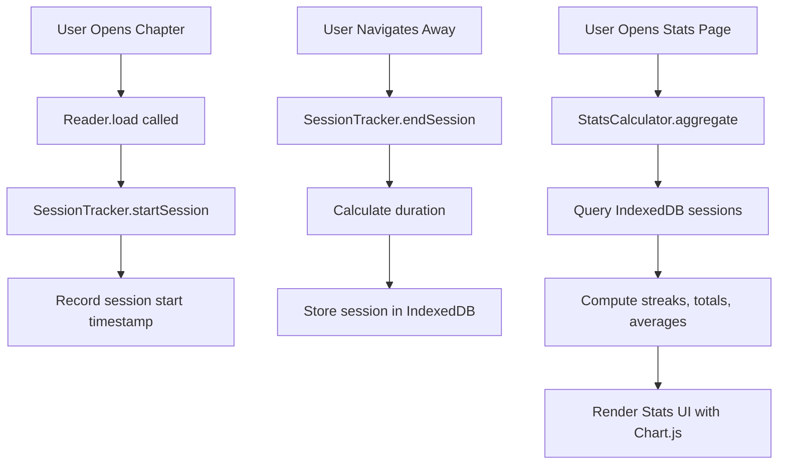

# Stats Page Architecture Plan

## Overview

Rewrite the existing history page into a comprehensive statistics dashboard that tracks reading habits, streaks, and engagement. All data will be stored in IndexedDB for persistence in a GitHub Pages environment.

## Current State Analysis

### Existing History Implementation
- Location: [`Selector.toggleHistory()`](js/app.js:491)
- Storage: localStorage with key `Settings_BibleHistory`
- Data: Simple array of chapter names (max 10 items)
- Issues: No timestamps, no duration, no statistics

### Data Storage Layer
- Location: [`adapter.js`](js/adapter.js:1)
- Current: localStorage only via `AppAPI.setGlobal()` / `AppAPI.getGlobal()`
- Needed: IndexedDB implementation for structured data

---

## Architecture Design

### System Flow



### Module Structure

```
js/
├── adapter.js          # Existing - keep for settings
├── app.js              # Existing - modify for stats integration
├── stats-db.js         # NEW - IndexedDB wrapper
├── stats-tracker.js    # NEW - Session tracking
├── stats-calculator.js # NEW - Statistics computation
└── stats-ui.js         # NEW - Stats page rendering
```

---

## IndexedDB Schema

### Database: `WordWideWebStats`
**Version: 1**

### Object Stores

#### 1. `reading_sessions`
Primary store for tracking each reading event.

| Field | Type | Description |
|-------|------|-------------|
| id | auto-increment | Primary key |
| book | string | Book name e.g. Genesis |
| chapter | number | Chapter number |
| sessionStart | ISO timestamp | When chapter was opened |
| sessionEnd | ISO timestamp | When user navigated away |
| durationSeconds | number | Calculated duration |
| dateKey | string | YYYY-MM-DD for quick queries |

**Indexes:**
- `dateKey` - For daily aggregations
- `book` - For book-level stats
- `sessionStart` - For chronological queries

#### 2. `daily_stats`
Pre-aggregated daily statistics for performance.

| Field | Type | Description |
|-------|------|-------------|
| dateKey | string | YYYY-MM-DD primary key |
| chaptersRead | number | Unique chapters read |
| totalSeconds | number | Total reading time |
| booksRead | array | List of books touched |
| versesHighlighted | number | Highlights created |
| notesCreated | number | Notes created |

#### 3. `book_progress`
Track completion status per book.

| Field | Type | Description |
|-------|------|-------------|
| bookName | string | Primary key |
| chaptersRead | array | List of chapter numbers read |
| lastRead | ISO timestamp | Most recent read |
| timesRead | number | How many times fully read |

#### 4. `engagement_events`
Track highlights, notes, and other interactions.

| Field | Type | Description |
|-------|------|-------------|
| id | auto-increment | Primary key |
| eventType | string | highlight, note, bookmark |
| book | string | Book name |
| chapter | number | Chapter number |
| verse | number | Optional verse number |
| timestamp | ISO timestamp | When event occurred |
| dateKey | string | YYYY-MM-DD |
| data | object | Event-specific data |

---

## Module Specifications

### 1. stats-db.js - IndexedDB Wrapper

```javascript
const StatsDB = {
    // Database config
    DB_NAME: 'WordWideWebStats',
    DB_VERSION: 1,
    db: null,
    
    // Initialize database
    init: async () => Promise<boolean>,
    
    // Session operations
    addSession: async (session) => Promise<number>,
    getSessionsByDate: async (dateKey) => Promise<array>,
    getSessionsByRange: async (startKey, endKey) => Promise<array>,
    
    // Daily stats operations
    updateDailyStats: async (dateKey) => Promise<void>,
    getDailyStats: async (dateKey) => Promise<object>,
    getDailyStatsRange: async (startKey, endKey) => Promise<array>,
    
    // Book progress operations
    updateBookProgress: async (book, chapter) => Promise<void>,
    getBookProgress: async (book) => Promise<object>,
    getAllBookProgress: async () => Promise<array>,
    
    // Engagement operations
    addEngagementEvent: async (event) => Promise<number>,
    getEngagementByDate: async (dateKey) => Promise<array>,
    
    // Utility
    clearAllData: async () => Promise<void>
};
```

### 2. stats-tracker.js - Session Tracking

```javascript
const SessionTracker = {
    currentSession: null,
    isActive: false,
    
    // Start tracking when chapter opens
    startSession: (book, chapter) => void,
    
    // End tracking when navigating away
    endSession: () => Promise<void>,
    
    // Pause/resume for tab visibility
    pauseSession: () => void,
    resumeSession: () => void,
    
    // Get current session info
    getCurrentSession: () => object
};
```

### 3. stats-calculator.js - Statistics Engine

```javascript
const StatsCalculator = {
    // Streak calculations
    getCurrentStreak: async () => Promise<number>,
    getLongestStreak: async () => Promise<number>,
    getStreakHistory: async (days) => Promise<array>,
    
    // Time-based aggregations
    getChaptersReadToday: async () => Promise<number>,
    getChaptersReadThisWeek: async () => Promise<number>,
    getChaptersReadThisMonth: async () => Promise<number>,
    getChaptersReadThisYear: async () => Promise<number>,
    
    // Time spent reading
    getTimeToday: async () => Promise<number>,
    getTimeThisWeek: async () => Promise<number>,
    getTimeThisMonth: async () => Promise<number>,
    getTimeTotal: async () => Promise<number>,
    
    // Reading patterns
    getHourlyDistribution: async () => Promise<array>,
    getWeeklyDistribution: async () => Promise<array>,
    getMonthlyTrend: async (months) => Promise<array>,
    
    // Book statistics
    getBooksCompleted: async () => Promise<number>,
    getMostReadBooks: async (limit) => Promise<array>,
    getReadingCoverage: async () => Promise<object>,
    
    // Engagement stats
    getTotalHighlights: async () => Promise<number>,
    getTotalNotes: async () => Promise<number>,
    getEngagementByBook: async (book) => Promise<object>
};
```

### 4. stats-ui.js - UI Rendering

```javascript
const StatsUI = {
    // Main render
    showStatsPage: async () => void,
    hideStatsPage: () => void,
    
    // Card renderers
    renderStreakCard: (current, longest) => HTMLElement,
    renderChaptersCard: (stats) => HTMLElement,
    renderTimeCard: (stats) => HTMLElement,
    renderBooksCard: (stats) => HTMLElement,
    
    // Chart renderers
    renderWeeklyChart: (data) => void,
    renderMonthlyChart: (data) => void,
    renderHourlyChart: (data) => void,
    
    // Helpers
    formatDuration: (seconds) => string,
    formatDate: (date) => string
};
```

---

## UI Design

### Stats Page Layout

```
┌─────────────────────────────────────────┐
│  ← Stats                                │
├─────────────────────────────────────────┤
│  ┌──────────┐  ┌──────────┐             │
│  │ 🔥 12    │  │ 📖 45    │             │
│  │ Day      │  │ Chapters │             │
│  │ Streak   │  │ This Week│             │
│  └──────────┘  └──────────┘             │
│                                         │
│  ┌─────────────────────────────────┐   │
│  │ Weekly Reading Activity         │   │
│  │ [Bar Chart - last 7 days]       │   │
│  └─────────────────────────────────┘   │
│                                         │
│  ┌──────────┐  ┌──────────┐             │
│  │ ⏱️ 2h 15m│  │ 📚 5     │             │
│  │ Time     │  │ Books    │             │
│  │ Today    │  │ Started  │             │
│  └──────────┘  └──────────┘             │
│                                         │
│  ┌─────────────────────────────────┐   │
│  │ Reading Time by Hour            │   │
│  │ [Line Chart - hourly distribut] │   │
│  └─────────────────────────────────┘   │
│                                         │
│  ┌─────────────────────────────────┐   │
│  │ Book Progress                   │   │
│  │ [Progress bars for each book]   │   │
│  └─────────────────────────────────┘   │
│                                         │
│  ┌──────────┐  ┌──────────┐             │
│  │ 📅 156   │  │ ✨ 23    │             │
│  │ Chapters │  │ Highlts  │             │
│  │ All Time │  │ Created  │             │
│  └──────────┘  └──────────┘             │
└─────────────────────────────────────────┘
```

### Stat Cards Detail

#### Streak Card
- Current reading streak (consecutive days)
- Longest streak badge
- Fire icon animation for active streak

#### Chapters Card
- Today count
- This week count  
- This month count
- This year count
- All-time total

#### Time Card
- Time today (formatted: Xh Xm)
- Time this week
- Time this month
- All-time total

#### Books Card
- Books started
- Books completed
- Percentage of Bible covered
- Most-read book

#### Charts
1. **Weekly Activity Bar Chart** - Last 7 days chapters/time
2. **Monthly Trend Line Chart** - Last 30 days activity
3. **Hourly Distribution** - When user reads most
4. **Book Progress Grid** - Visual map of Bible coverage

---

## Integration Points

### Modify Reader Module

In [`Reader.load()`](js/app.js:557):
```javascript
// Add after line 572
SessionTracker.startSession(book, chapter);
```

Create new navigation handler:
```javascript
// Before any navigation away from reader
Reader.beforeNavigate = () => {
    SessionTracker.endSession();
};
```

### Modify App Module

In [`App.goHome()`](js/app.js:155):
```javascript
// Add at start
SessionTracker.endSession();
```

### Add Visibility Tracking

```javascript
// Track tab visibility for accurate time
document.addEventListener('visibilitychange', () => {
    if (document.hidden) {
        SessionTracker.pauseSession();
    } else {
        SessionTracker.resumeSession();
    }
});
```

### Router Integration

Add stats route to [`Router.handleRoute()`](js/app.js:77):
```javascript
if(parts[0] === 'stats') {
    return { type: 'stats' };
}

// In handleRoute switch:
case 'stats':
    StatsUI.showStatsPage(true);
    break;
```

### Header Button

Replace history button with stats button:
```html
<button class="icon-btn" id="btnStats" onclick="StatsUI.showStatsPage()">
    <span class="material-icons-round">bar_chart</span>
</button>
```

---

## Chart.js Integration

### CDN Import
Add to `index.html`:
```html
<script src="https://cdn.jsdelivr.net/npm/chart.js@4.4.1/dist/chart.umd.min.js"></script>
```

### Chart Configurations

```javascript
// Weekly activity chart
{
    type: 'bar',
    data: {
        labels: ['Mon', 'Tue', 'Wed', 'Thu', 'Fri', 'Sat', 'Sun'],
        datasets: [{
            label: 'Chapters Read',
            data: [/* daily counts */],
            backgroundColor: 'var(--primary-color)'
        }]
    },
    options: {
        responsive: true,
        maintainAspectRatio: false,
        plugins: { legend: { display: false } }
    }
}

// Hourly distribution chart
{
    type: 'line',
    data: {
        labels: ['12am', '3am', '6am', '9am', '12pm', '3pm', '6pm', '9pm'],
        datasets: [{
            label: 'Reading Sessions',
            data: [/* hourly counts */],
            borderColor: 'var(--primary-color)',
            tension: 0.4,
            fill: true
        }]
    }
}
```

---

## Data Migration

### Migrate Existing History

On first load of new stats system:
1. Read existing `Settings_BibleHistory` from localStorage
2. Create synthetic sessions for each history item
3. Use estimated duration (e.g., 5 minutes per chapter)
4. Store in IndexedDB
5. Keep localStorage history for backwards compatibility

```javascript
const migrateOldHistory = async () => {
    const oldHistory = AppAPI.getGlobal('BibleHistory');
    if (!oldHistory) return;
    
    const items = JSON.parse(oldHistory);
    for (const item of items) {
        // Parse "Genesis 1" format
        const parts = item.split(' ');
        const chapter = parseInt(parts.pop());
        const book = parts.join(' ');
        
        // Create estimated session
        await StatsDB.addSession({
            book,
            chapter,
            sessionStart: new Date().toISOString(),
            sessionEnd: new Date().toISOString(),
            durationSeconds: 300, // 5 min estimate
            dateKey: new Date().toISOString().split('T')[0]
        });
    }
};
```

---

## Performance Considerations

### IndexedDB Indexing Strategy
- All queries use indexed fields
- Date-based queries use `dateKey` index
- Range queries optimized with compound indexes

### Caching Strategy
- Daily stats pre-aggregated on session end
- Stats page reads from aggregated tables
- Recalculate only when viewing stats page

### Chart Data Limits
- Weekly chart: 7 data points
- Monthly chart: 30 data points
- Hourly chart: 24 data points
- All within Chart.js performance limits

---

## Testing Checklist

- [ ] IndexedDB initializes correctly
- [ ] Sessions start when chapter opens
- [ ] Sessions end when navigating away
- [ ] Tab visibility pauses/resumes tracking
- [ ] Streaks calculate correctly across days
- [ ] Charts render with real data
- [ ] Data persists across page reloads
- [ ] Migration handles old history
- [ ] Theme changes apply to charts
- [ ] Mobile responsive layout works

---

## File Changes Summary

### New Files
1. `js/stats-db.js` - IndexedDB wrapper
2. `js/stats-tracker.js` - Session tracking
3. `js/stats-calculator.js` - Statistics engine
4. `js/stats-ui.js` - UI rendering

### Modified Files
1. `index.html` - Add stats view, Chart.js CDN
2. `js/app.js` - Integrate tracking, add routing
3. `js/adapter.js` - Keep for settings compatibility
4. `css/style.css` - Stats page styles

### Removed
- History functionality in `Selector.toggleHistory()` will be replaced

---

## Implementation Order

1. **Phase 1: Data Layer**
   - Create `stats-db.js` with IndexedDB schema
   - Test database operations

2. **Phase 2: Tracking**
   - Create `stats-tracker.js`
   - Integrate with `Reader.load()`
   - Add visibility tracking

3. **Phase 3: Calculation**
   - Create `stats-calculator.js`
   - Implement all aggregation functions

4. **Phase 4: UI**
   - Add stats view to `index.html`
   - Create `stats-ui.js`
   - Add Chart.js integration
   - Style with `css/style.css`

5. **Phase 5: Integration**
   - Update routing
   - Replace history button
   - Test end-to-end
