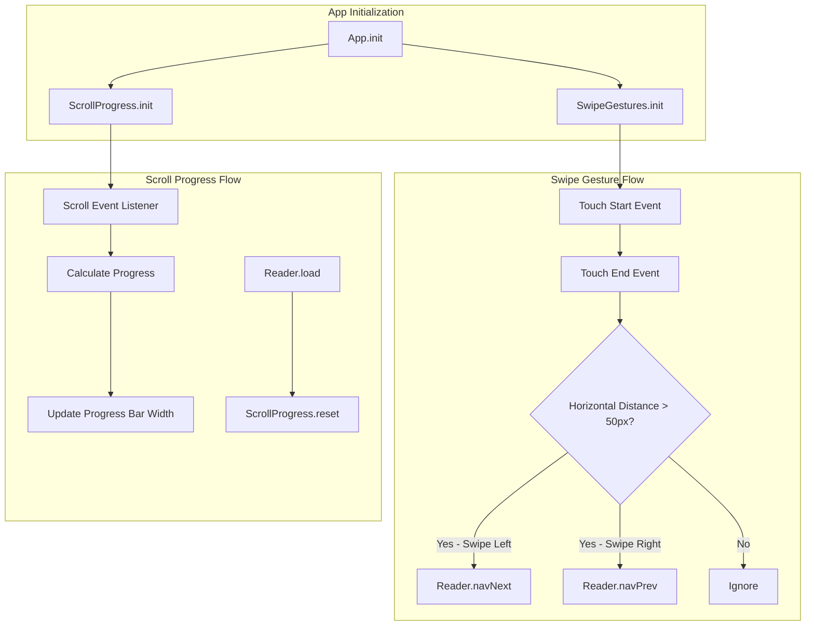

# Implementation Plan: Swipe Gestures & Scroll Progress Bar

## Overview

This plan outlines the implementation of two features for WordWideWeb:
1. **Swipe Gestures** - Horizontal swipe detection for chapter navigation
2. **Scroll Progress Bar** - Visual indicator showing reading progress within current chapter

---

## Feature 1: Swipe Gestures for Chapter Navigation

### Current State Analysis

From [`js/app.js`](js/app.js):
- [`Reader.navNext()`](js/app.js:604) already exists for navigating to next chapter
- No `navPrev()` function exists for previous chapter navigation
- The reader view is `#view-reader` containing `#contentArea`

### Implementation Details

#### 1.1 Add Previous Chapter Navigation Function

Create a new function `Reader.navPrev()` in [`js/app.js`](js/app.js):

```javascript
navPrev: () => {
    const parts = Reader.currentName.split(" ");
    const num = parseInt(parts[parts.length-1]);
    const book = parts.slice(0, parts.length-1).join(" ");
    
    // Don't navigate if at chapter 1
    if (num <= 1) return;
    
    const prevName = `${book} ${num-1}`;
    const path = `bibles/BSB/BER-${book}/${prevName}.md`;
    Reader.load(path, prevName);
}
```

#### 1.2 Create Swipe Gesture Handler Module

Add a new `SwipeGestures` module in [`js/app.js`](js/app.js):

```javascript
const SwipeGestures = {
    touchStartX: 0,
    touchStartY: 0,
    touchEndX: 0,
    touchEndY: 0,
    minSwipeDistance: 50,  // Minimum distance in pixels
    maxVerticalDistance: 100, // Max vertical drift allowed
    
    init: () => {
        const readerView = document.getElementById('view-reader');
        readerView.addEventListener('touchstart', SwipeGestures.handleTouchStart, { passive: true });
        readerView.addEventListener('touchend', SwipeGestures.handleTouchEnd, { passive: true });
    },
    
    handleTouchStart: (e) => {
        SwipeGestures.touchStartX = e.changedTouches[0].screenX;
        SwipeGestures.touchStartY = e.changedTouches[0].screenY;
    },
    
    handleTouchEnd: (e) => {
        SwipeGestures.touchEndX = e.changedTouches[0].screenX;
        SwipeGestures.touchEndY = e.changedTouches[0].screenY;
        SwipeGestures.processSwipe();
    },
    
    processSwipe: () => {
        const deltaX = SwipeGestures.touchEndX - SwipeGestures.touchStartX;
        const deltaY = Math.abs(SwipeGestures.touchEndY - SwipeGestures.touchStartY);
        
        // Check if horizontal swipe is significant and vertical drift is minimal
        if (Math.abs(deltaX) > SwipeGestures.minSwipeDistance && 
            deltaY < SwipeGestures.maxVerticalDistance) {
            
            if (deltaX > 0) {
                // Swipe right - go to previous chapter
                Reader.navPrev();
            } else {
                // Swipe left - go to next chapter
                Reader.navNext();
            }
        }
    }
};
```

#### 1.3 Initialize Swipe Gestures

Add initialization in [`App.init()`](js/app.js:124):

```javascript
init: async () => {
    Settings.init();
    Selector.init();
    ReadingPlans.init();
    SwipeGestures.init(); // Add this line
    // ... rest of init
}
```

### Files to Modify

| File | Changes |
|------|---------|
| [`js/app.js`](js/app.js) | Add `Reader.navPrev()`, `SwipeGestures` module, initialize in `App.init()` |

---

## Feature 2: Scroll Progress Bar

### Current State Analysis

From [`index.html`](index.html):
- Header is sticky at top with `z-index: 100`
- Reader content is in `#contentArea` within `#view-reader`

From [`css/style.css`](css/style.css):
- Header styling at line 89-99
- Theme variables support light/dark/AMOLED modes

### Implementation Details

#### 2.1 Add Progress Bar HTML

Add progress bar element in [`index.html`](index.html) after the `<header>` element:

```html
<!-- Scroll Progress Bar -->
<div id="scrollProgressBar" class="scroll-progress-bar">
    <div id="scrollProgressFill" class="scroll-progress-fill"></div>
</div>
```

#### 2.2 Add Progress Bar CSS

Add styles in [`css/style.css`](css/style.css):

```css
/* --- SCROLL PROGRESS BAR --- */
.scroll-progress-bar {
    position: fixed;
    top: 56px; /* Below header */
    left: 0;
    right: 0;
    height: 3px;
    background: transparent;
    z-index: 99;
    pointer-events: none;
}

.scroll-progress-fill {
    height: 100%;
    width: 0%;
    background: var(--primary-color);
    transition: width 0.1s ease-out;
}

/* Hide progress bar when not in reader view */
#view-reader.hidden ~ .scroll-progress-bar {
    opacity: 0;
}
```

#### 2.3 Create Scroll Progress Module

Add `ScrollProgress` module in [`js/app.js`](js/app.js):

```javascript
const ScrollProgress = {
    progressBar: null,
    progressFill: null,
    
    init: () => {
        ScrollProgress.progressBar = document.getElementById('scrollProgressBar');
        ScrollProgress.progressFill = document.getElementById('scrollProgressFill');
        
        window.addEventListener('scroll', ScrollProgress.updateProgress, { passive: true });
    },
    
    updateProgress: () => {
        // Only update when reader view is visible
        const readerView = document.getElementById('view-reader');
        if (readerView.classList.contains('hidden')) {
            ScrollProgress.setProgress(0);
            return;
        }
        
        const scrollTop = window.pageYOffset || document.documentElement.scrollTop;
        const scrollHeight = document.documentElement.scrollHeight - document.documentElement.clientHeight;
        
        if (scrollHeight <= 0) {
            ScrollProgress.setProgress(0);
            return;
        }
        
        const progress = (scrollTop / scrollHeight) * 100;
        ScrollProgress.setProgress(progress);
    },
    
    setProgress: (percent) => {
        if (ScrollProgress.progressFill) {
            ScrollProgress.progressFill.style.width = `${Math.min(100, Math.max(0, percent))}%`;
        }
    },
    
    reset: () => {
        ScrollProgress.setProgress(0);
    }
};
```

#### 2.4 Initialize and Integrate

Add initialization in [`App.init()`](js/app.js:124):

```javascript
init: async () => {
    Settings.init();
    Selector.init();
    ReadingPlans.init();
    SwipeGestures.init();
    ScrollProgress.init(); // Add this line
    // ... rest of init
}
```

Reset progress when loading new chapter in [`Reader.load()`](js/app.js:503):

```javascript
load: async (path, name, skipRouteUpdate = false) => {
    // ... existing code ...
    
    ScrollProgress.reset(); // Reset progress bar for new chapter
    
    // ... rest of load function
}
```

### Files to Modify

| File | Changes |
|------|---------|
| [`index.html`](index.html) | Add progress bar HTML elements |
| [`css/style.css`](css/style.css) | Add progress bar styles |
| [`js/app.js`](js/app.js) | Add `ScrollProgress` module, initialize, integrate with `Reader.load()` |

---

## Architecture Diagram



---

## Testing Considerations

### Swipe Gestures
- Test on touch devices (mobile/tablet)
- Verify swipe doesn't interfere with text selection
- Test edge cases: first chapter (no prev), last chapter (no next)
- Verify vertical scrolling isn't affected

### Scroll Progress Bar
- Test on all themes (light, dark, AMOLED)
- Verify progress resets on chapter change
- Test with short and long chapters
- Verify visibility only in reader view

---

## Implementation Order

1. Add `Reader.navPrev()` function
2. Add `SwipeGestures` module and initialization
3. Add progress bar HTML elements
4. Add progress bar CSS styles
5. Add `ScrollProgress` module and initialization
6. Integrate `ScrollProgress.reset()` with `Reader.load()`
7. Update [`Readme.md`](Readme.md) to mark features as implemented
